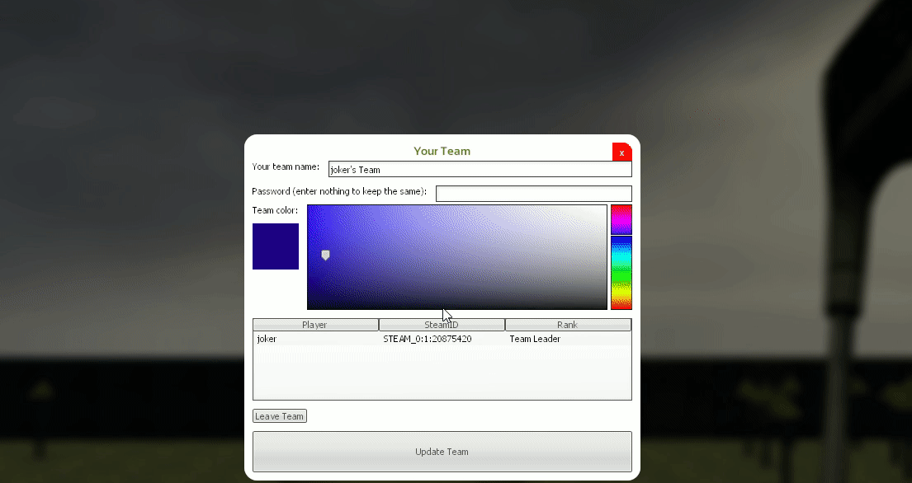

# About Minigolf

A free of charge minigolf addon for Garry's Mod. Play a relaxing game of minigolf/putt-putt on any compatible map.

You can play the included gamemode (gm_minigolf) or load any compatible map on Sandbox (or other gamemodes).


## Gifs

__⛳ Play holes built by a mapper ([see how in the mapping guide](docs/MAPPING_GUIDE.md))__


__💯 Play those holes with friends in a customizable team (T) and check your scores on the scoreboard (TAB)__ *(Only available in the gamemode)*


__😈 Adjustable speed Windmills and other track obstacles for your friends to annoy you with__


# Installation, Starting and Configuration

## Requirements

* Garry's Mod

* A server with a tickrate of at least 66

  *At 33 ticks the ball bounces vertically unrealistically due to physics being calculated too slowly.*

* Git [(for Windows)](https://git-scm.com/download/win):
  
  *Optional, but required to follow the instructions below.*


## Installation instructions


### Workshop

This gamemode is available on workshop. [Subscribe here](https://steamcommunity.com/sharedfiles/filedetails/?id=2313854259) to quickly install this gamemode.

For your dedicated server you will want to add [a workshop collection like this](https://steamcommunity.com/sharedfiles/filedetails/?id=2232411122) to your server using the startup parameter: `+host_workshop_collection 2232411122`


### Manual

1. Make sure you have installed the software and addons listed in the `Requirements` above.
2. Navigate to your `garrysmod/addons` directory and open a terminal/command prompt
3. Clone this repo inside the `garrysmod/addons` directory using this command:
  `git clone https://github.com/luttje/gmod-minigolf gm_minigolf`


## Starting the gamemode

**Example startup parameters for a dedicated server:**
```
./srcds_run -game garrysmod -tickrate 66 +gamemode gm_minigolf +map golf_rocket_hub_alpha2 -maxplayers 32 -disableluarefresh
```

## Configurations

You can customize how this addon behaves in the map, using console variables (Convars) or with your own code. Read more about it here:
* [Console Commands and PointShop rewards](docs/CONFIGURATIONS.md)
* [Mapping Guide](docs/MAPPING_GUIDE.md)


## Additional tools for development

You can have your editor show you helpful information on the code through EmmyLua ([this extension for VSCode](https://github.com/EmmyLua/VSCode-EmmyLua) or this [extension for Rider](https://plugins.jetbrains.com/plugin/9768-emmylua/versions)).

We try to develop the code with helpful EmmyLua annotations. At the same time you may be interested in EmmyLua information on all the Garry's Mod Lua definitions. You can find those [in this repo](https://github.com/luttje/glua-api-snippets). When symlinking or copying that directory into this gamemode, ensure you place it in the `.glua/` directory. This directory has been gitignored so the definitions don't get pushed online.


# ❤ Contributing

If you want to improve some code in this gamemode, feel free to open a ticket or shoot in your Pull Request. I'm not intending to maintain this repository full-time, though I'll merge in good additions when I find the time. Please have a look (and feel free to contribute) to the [`docs/CONTRIBUTING.md`](docs/CONTRIBUTING.md)


## Mapping

The mapper is the one in control of the golf tracks, for instructions on how to design the map look at [the mapping guide](docs/MAPPING_GUIDE.md)

For a map to play on check out the [`maps/`](maps/) directory. Or for the `.vmf` source files check [the mapping guide for links](docs/MAPPING_GUIDE.md)


## Support me / Donate

Thank you very much if you want to support me financially through a donation. I accept donations through PayPal.

[](https://www.paypal.com/donate?hosted_button_id=XGVDN2YMXC8TL) _It makes me happy to hear you enjoy the gamemode so much!_


# Credits

When code is copied and/or inspired by someone else you will find a comment above/near that code specifying where the code was sourced from. The rest of the source-code was made by Luttje and it is licensed under the MIT License. 


## Special thanks to

* __Elkinda__, for creating an awesome map
* __Tori__, for supporting the project
* __Syff__, for graphics, web-development and generally being supportive


## License

See the [LICENSE](LICENSE) file for the full license information.
